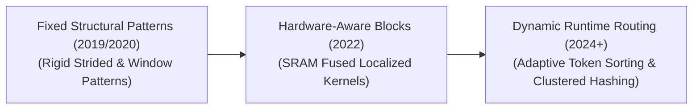

# Awesome-Sparse-Attention
## Sparse Attention: Evolution, Variants, Types, & Applications

Sparse Attention is a collection of algorithmic modifications designed to solve the quadratic computational complexity ($O(N^2)$) and heavy memory footprint of the standard Full Self-Attention mechanism in Transformer models. In standard attention, every token in a sequence must calculate a dot-product score with every other token, which creates an infrastructure bottleneck when processing long context windows (e.g., full books, codebase audits, or high-resolution video clips). Sparse Attention mitigates this by restricting the attention matrix, forcing tokens to compute scores only with a highly relevant, pre-defined, or dynamically discovered subset of other tokens, reducing time and space complexity to near-linear or log-linear scaling ($O(N \log N)$ or $O(N)$).

---

## 1. The Chronological Evolution

The technical progression of attention sparsification reflects a transition from hand-crafted, rigid geometric masks to localized block kernels, moving toward dynamic, data-dependent clustering routing.

| Era | Concept & Details | Year First Used | Paper Link |
| :--- | :--- | :--- | :--- |
| **[The Heuristic Fixed Pattern Era](pages/heuristic_fixed_pattern.md) (~2019–2021)** | *Concept:* Introduced by early architectures like **Sparse Transformer**, **Longformer**, and **BigBird**. Engineers combined fixed, hand-crafted geometric masks—such as local sliding windows, dilated or strided patterns, and static global token points—to manually construct an approximation of a full attention matrix.  *Limitation:* Rigid and unable to dynamically adapt to complex data dependencies where relevant context fragments shift location based on content semantics. | 2019 | [Sparse Transformer](https://arxiv.org/abs/1904.10509) |
| **[The Hardware-Aware Block-Sparse Era](pages/hardware_aware_block_sparse.md) (~2022–2024)** | *Concept:* Formally established by **FlashAttention** and custom **Block-Sparse Kernels**. Instead of masking individual, isolated tokens (which causes low GPU tensor core utilization), this era grouped parameters into dense, localized blocks or tiles, executing sparse matrix multiplications natively in on-chip GPU SRAM.  *Significance:* Successfully mapped theoretical mathematical sparsity into real-world physical wall-clock speedups, unlocking the first stable 32k to 128k context windows. | 2022 | [FlashAttention](https://arxiv.org/abs/2205.14135) |
| **[The Dynamic & Latent Decomposed Era](pages/dynamic_latent_decomposed.md) (~2024–Present)** | *Concept:* The modern frontier state-of-the-art framework. Popularized by architectures like **[Reformer](pages/reformer.md)** (using Locality-Sensitive Hashing), **TriForce**, and DeepSeek's **[Multi-Head Latent Attention](pages/multi_head_latent.md) (MLA)**. Rather than relying on fixed patterns, the model uses runtime tracking, low-rank compression, or adaptive token routing to dynamically select which token blocks are loaded into memory at any given step. | 2024 | [DeepSeek-V2](https://arxiv.org/abs/2405.04434) |

---

## 2. Core Functional & Architectural Variants

Sparse Attention patterns are strictly categorized based on how the connectivity map between queries and keys is constructed and maintained throughout the forward pass.

| Variant | Mechanism & Pros | Year First Used | Paper Link |
| :--- | :--- | :--- | :--- |
| **[Local Sliding Window Attention](pages/local_sliding_window.md)** | *Mechanism:* A token at index $i$ can only attend to a small, fixed window of neighbors immediately surrounding it (e.g., $i \pm w/2$).  *Pros:* Reduces complexity to strictly linear scaling ($O(N)$). When stacked over deep transformer layers, receptive fields expand, allowing high-level abstractions to travel across the sequence. | 2019 | [Sparse Transformer](https://arxiv.org/abs/1904.10509) |
| **[Strided / Dilated Attention](pages/strided_dilated.md)** | *Mechanism:* The attention mask skips indices at a regular, fixed periodic interval (e.g., a token at index $i$ only checks keys at indices $i - 2, i - 4, i - 6$, etc.).  *Pros:* Allows the model to capture macro-level periodic text or audio structures across longer distance spans without expanding the token budget. | 2019 | [Sparse Transformer](https://arxiv.org/abs/1904.10509) |
| **[Global / Anchor Token Attention](pages/global_anchor_token.md)** | *Mechanism:* Designates a small set of critical tokens (such as the `[CLS]` token, punctuation marks, or specialized synthetic summary nodes) as "global anchors." Every token in the sequence must attend to these anchors, and the anchors attend back to every token.  *Pros:* Acts as an express information highway, allowing distant data blocks to exchange semantic insights in a single layer step. | 2020 | [Longformer](https://arxiv.org/abs/2004.05150) |
| **[Dynamic / Content-Dependent Attention](pages/dynamic_content_dependent.md)** | *Mechanism:* Computes a fast, low-cost approximation function (like a hash or low-rank projection) over incoming tokens at runtime, automatically sorting and clustering similar queries and keys into the same attention blocks. | 2020 | [[Reformer](pages/reformer.md)](https://arxiv.org/abs/2001.04451) |

---

## 3. High-Yield Production Implementations

Multiple distinct algorithmic strategies are used to deploy sparse attention layers in consumer and enterprise-scale model frameworks.

| Implementation | Type & Mechanism | Year First Used | Paper Link |
| :--- | :--- | :--- | :--- |
| **[Longformer / BigBird](pages/longformer_bigbird.md) (Fixed Hybrid Pattern)** | *Type:* Heuristic Combination.  *Mechanism:* Merges Local Window, Strided, and Global Anchor tokens into a single, unified attention layer configuration, creating a robust, sparse approximation of full context coverage. | 2020 | [BigBird](https://arxiv.org/abs/2007.14062) |
| **[Reformer](pages/reformer.md) (Locality-Sensitive Hashing - LSH)** | *Type:* Algorithmic Hashing Routing.  *Mechanism:* Uses angular LSH to project queries and keys into high-dimensional buckets. Tokens that fall into the exact same bucket are mathematically guaranteed to have high similarity, allowing the model to execute attention calculations *strictly within individual buckets*. | 2020 | [[Reformer](pages/reformer.md)](https://arxiv.org/abs/2001.04451) |
| **[Multi-Head Latent Attention](pages/multi_head_latent.md) (MLA)** | *Type:* Low-Rank Decomposed Sparsification.  *Mechanism:* Heavily compresses the active Key-Value (KV) cache dimension down into a tiny latent vector before the multi-head attention projection occurs. It up-projects the compressed coordinates dynamically in fast SRAM during kernel execution.  *Significance:* Drastically scales down Key-Value cache VRAM overhead, outperforming standard Grouped-Query Attention (GQA) while retaining full-attention accuracy. | 2024 | [DeepSeek-V2](https://arxiv.org/abs/2405.04434) |

---

## 4. Production Engineering Challenges & Bottlenecks

While Sparse Attention offers elegant mathematical complexity reductions on paper, executing it on real-world silicon hardware presents explicit constraints.

| Challenge | The Problem & Mitigation | Year First Used | Paper Link |
| :--- | :--- | :--- | :--- |
| **[The "Unstructured Sparsity" Penalty](pages/unstructured_sparsity_penalty.md)** | *The Problem:* Modern GPU hardware is optimized exclusively for highly regular, dense matrix multiplication. If a sparse attention algorithm drops individual random tokens arbitrarily across a tensor, the hardware must perform disjointed memory lookups, resulting in severe processing latency that erases any theoretical mathematical gains.  *Mitigation:* transition entirely to **Block-Sparse Execution Structures**, ensuring that any sparsity pattern operates over strict $16 \times 16$ or $64 \times 64$ dense block arrays to keep tensor cores running at full efficiency. | 2019 | [Sparse Transformer](https://arxiv.org/abs/1904.10509) |
| **[The KV Cache Eviction Dilemma](pages/kv_cache_eviction.md)** | *The Problem:* During long-context autoregressive inference generation, tracking which historical tokens are safe to drop from memory without triggering performance degradation or logic loops is highly volatile.  *Mitigation:* Implementing **Streaming Attention** layers (like AttentionSink or H2O), which permanently freeze and protect the very first 4 tokens (the attention sink anchor) and the most recent local tokens, while dynamically evicting intermediate, low-activation parameters. | 2023 | [StreamingLLM](https://arxiv.org/abs/2309.17453) |

---

## 5. Frontier Real-World Applications

| Application | Description | Year First Used | Paper Link |
| :--- | :--- | :--- | :--- |
| **[Long-Document Legislative & Financial Auditing](pages/long_document_auditing.md)** | *Application:* Processes thousands of pages of corporate financial statements or legal regulatory filings concurrently. Sparse attention configurations permit the model to read entire document portfolios in a single forward pass, maintaining cross-document entity alignment without blowing up cloud VRAM budgets. | 2020 | [BigBird](https://arxiv.org/abs/2007.14062) |
| **[High-Resolution Biological Genomic Mapping](pages/biological_genomic_mapping.md)** | *Application:* Translates massive DNA or protein sequences, which span hundreds of thousands of base-pair tokens (A, C, G, T). Because genetic mutations often exhibit distant spatial structures or long-range periodic dependencies, strided and block-sparse attention models map macro-molecular profiles efficiently. | 2021 | [Enformer](https://www.nature.com/articles/s41592-021-01252-x) |
| **[Spatio-Temporal Video Frame Modeling](pages/video_frame_modeling.md)** | *Application:* Powers video generation foundation platforms. Instead of allowing every pixel across every frame to attend to every other pixel globally, the system uses factorized sparse axial attention—alternating between a purely spatial attention head pass (image structure) and a temporal attention head pass (motion trajectory)—keeping multi-minute video processing computationally feasible. | 2021 | [TimeSformer](https://arxiv.org/abs/2102.05095) |

