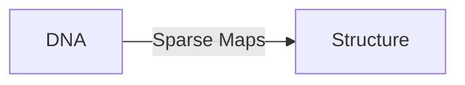

# High-Resolution Genomic Mapping

## Overview
Translates massive DNA/protein sequences taking advantage of block-sparse structure for long-range periodic structures.

## Diagram

```mermaid
graph LR
    DNA -->|Sparse Maps| Structure
```
