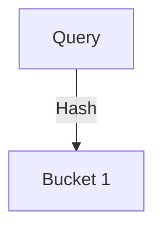

# Dynamic / Content-Dependent Attention

## Overview
Computes approximation functions at runtime to sort and cluster similar queries and keys.

## Diagram

```mermaid
graph TD
    A[Query] -->|Hash| B[Bucket 1]
```
