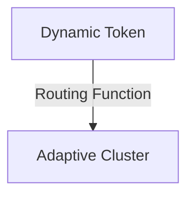

# The Dynamic & Latent Decomposed Era

## Overview
Modern state-of-the-art framework (2024+). Uses runtime tracking, low-rank compression, and adaptive token routing dynamically.

## Diagram

```mermaid
graph TD
    A[Dynamic Token] -->|Routing Function| B[Adaptive Cluster]
```
