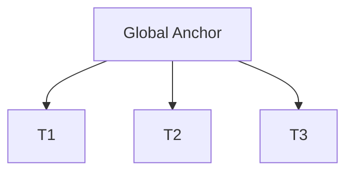

# Global / Anchor Token Attention

## Overview
Designates critical tokens that attend to and from all other tokens in the sequence.

## Diagram

```mermaid
graph TD
    G[Global Anchor] --> T1
    G --> T2
    G --> T3
```
