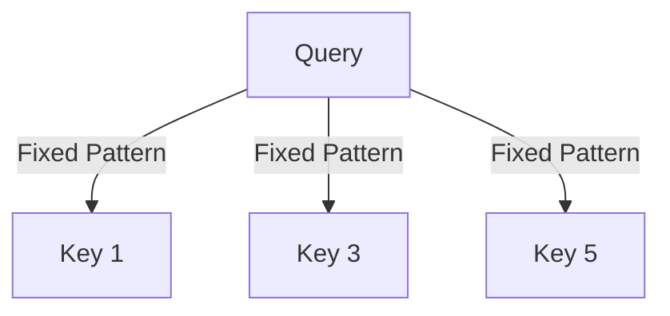

# The Heuristic Fixed Pattern Era

## Overview
During 2019-2021, early sparse attention models like Sparse Transformer, Longformer, and BigBird were introduced. They used fixed, hand-crafted geometric masks to approximate full attention.

## Diagram

