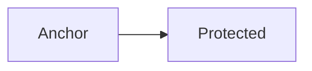

# The KV Cache Eviction Dilemma

## Overview
Dropping old tokens might hurt context. Streaming Attention and AttentionSinks fix this by preserving anchor tokens.

## Diagram

```mermaid
graph LR
    A[Anchor] --> B[Protected]
```
