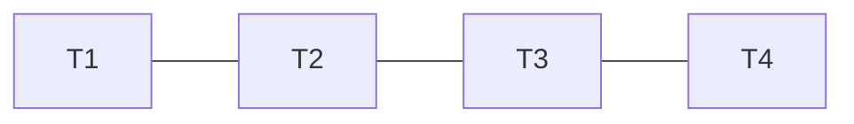

# Local Sliding Window Attention

## Overview
A token only attends to a small, fixed window of neighbors immediately surrounding it, resulting in O(N) complexity.

## Diagram

```mermaid
graph LR
    T1 --- T2 --- T3 --- T4
```
