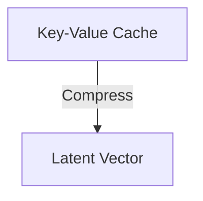

# Multi-Head Latent Attention (MLA)

## Overview
Compresses active KV cache into a tiny latent vector to drastically scale down VRAM overhead.

## Diagram

```mermaid
graph TD
    KV[Key-Value Cache] -->|Compress| L[Latent Vector]
```
