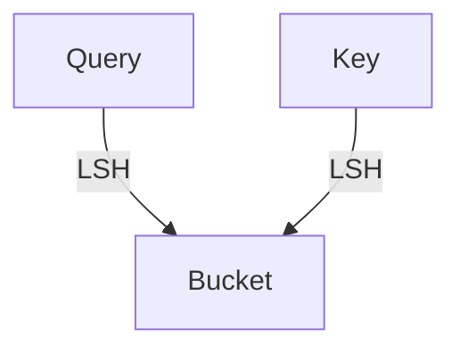

# Reformer (LSH)

## Overview
Uses Locality-Sensitive Hashing to project queries and keys into high-dimensional buckets for efficient routing.

## Diagram

```mermaid
graph TD
    Q[Query] -->|LSH| Bucket
    K[Key] -->|LSH| Bucket
```
