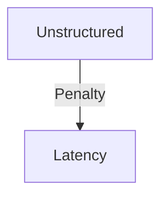

# The Unstructured Sparsity Penalty

## Overview
Arbitrary random token drops cause unaligned GPU lookups. Moving to block-sparse structure resolves this.

## Diagram

```mermaid
graph TD
    A[Unstructured] -->|Penalty| B[Latency]
```
