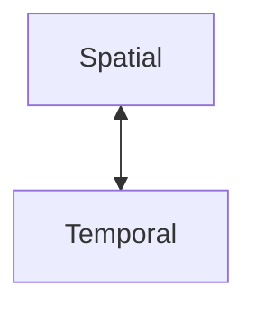

# Video Frame Modeling

## Overview
Factorized sparse axial attention alternating between spatial and temporal attention passes.

## Diagram

```mermaid
graph TD
    F1[Spatial] <--> F2[Temporal]
```
